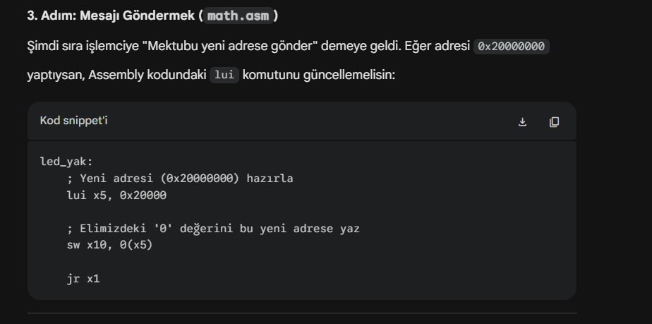
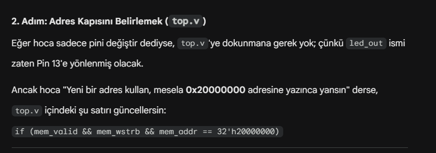

# PicoRV32 Assembler, Linker & Integrated Management GUI

Bu proje, RISC-V (RV32I) mimarisine özel olarak geliştirilmiş bir **Assembler**, **Linker** ve bunların yönetimini kolaylaştıran modern bir **Python Arayüzü (GUI)** içermektedir. Ayrıca, projede **Gowin FPGA** üzerinde çalıştırılabilen **PicoRV32** işlemci donanım kodları da yer almaktadır.

### Arayüz Görseli


## 📌 Özellikler

- **C Tabanlı Assembler (`assembler.c`)**: RISC-V assembly (`.asm`) kodlarını okuyup, makine koduna (object file - `.o`) dönüştürür.
  - İki aşamalı (Two-Pass) derleme işlemi.
  - Global ve lokal sembol yönetimi (Hash Table tabanlı ESTAB).
  - Genişletilmiş RV32I komut seti desteği (R, I, S, B, J, U Type).
- **C Tabanlı Linker (`linker.c`)**: Birden fazla `.o` dosyasını bağlayıp (link) nihai çalıştırılabilir `output.mem` donanım hafıza dosyasını oluşturur.
  - Text ve Data segmentleri için başlangıç adresi ayarlanabilmesi (`-Ttext`, `-Tdata`).
  - Çözümlenemeyen sembolleri harici sembol tablosu (ESTAB) ile çözme.
- **Python GUI Yönetim Paneli (`arayuz.py`)**: 
  - Koyu tema ve modern tasarım.
  - `.o` (obje) dosyalarını görsel arayüz üzerinden ekleme.
  - ESTAB tablosunun ve linker loglarının anlık analizi.
  - Üretilen Firmware (output.mem) içeriğinin canlı görüntülenmesi.
- **Gowin FPGA Desteği (`GOWIN_CODE`)**: Gowin IDE ile doğrudan kullanıma hazır PicoRV32 işlemci Verilog modülleri, bellek bileşenleri ve pin atamaları.

---

## 🛠️ Kurulum ve Derleme (Build)

Projedeki C kodlarını derlemek için sisteminizde `gcc` yüklü olması gerekmektedir. 

```bash
# Assembler'ı derlemek için:
gcc assembler.c -o assembler.exe

# Linker'ı derlemek için:
gcc linker.c -o linker.exe
```

## 🚀 Kullanım

Projeyi çalıştırmanın iki yolu vardır: Manuel olarak komut satırından ya da Python Arayüzü üzerinden.

### 1. Python Arayüzü İle Kullanım (Tavsiye Edilen)
Görsel arayüzü başlatmak için sisteminizde Python yüklü olmalıdır.

```bash
python arayuz.py
```
Arayüz üzerinden:
1. `+ Obje Dosyası Ekle` butonu ile `.o` dosyalarınızı seçin.
2. T-Text ve T-Data bellek adreslerini ayarlayın.
3. `LINKLE VE ANALİZ ET` butonuna basarak işlemleri tamamlayıp, sonuçları görüntüleyin.

### 2. Komut Satırı İle Manuel Kullanım

Örnek assembly kodlarını (`.asm`) obje kodlarına (`.o`) çevirmek:
```bash
./assembler.exe main.asm main.o
./assembler.exe math.asm math.o
```

Oluşan obje dosyalarını Linker ile bağlayıp hafıza dosyasını (`output.mem`) oluşturmak:
```bash
./linker.exe -Ttext 0x00000000 -Tdata 0x00001000 -o output.mem main.o math.o
```

---

## 💻 Gowin FPGA Entegrasyonu ve Kart Özellikleri

Oluşturulan nihai `output.mem` veya `firmware.mem` dosyasını, `GOWIN_CODE` klasöründeki FPGA projenize dahil edebilirsiniz.

### Kart Özellikleri (Pinmap)

Gowin dizin yapısı:
- `picorv32.v`: İşlemcinin çekirdek donanım tanımı.
- `memory.v`: Hafıza bloğu.
- `top.v`: Üst seviye donanım modülü.
- `pinler.cst`: Gowin FPGA fiziksel pin bağlantıları.

Projeyi Gowin IDE'de açarak donanıma yükleme yapabilirsiniz.

## 👨‍💻 Geliştirici
- [Yasin Yılmaz](https://github.com/yasinyilmaaz)
